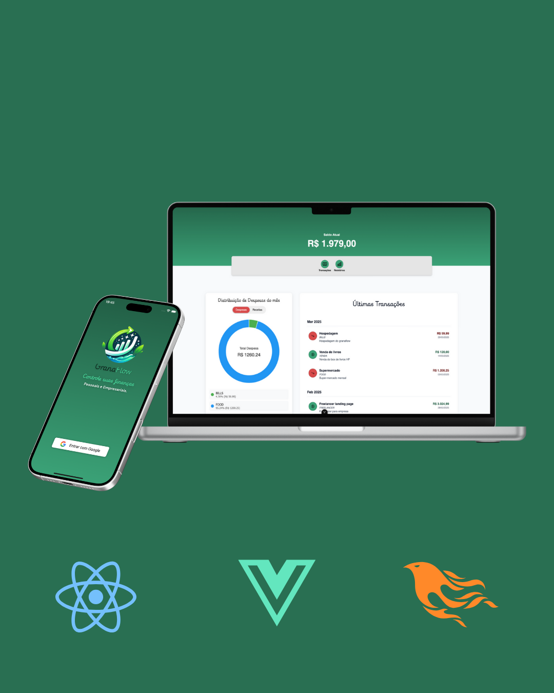

# GranaFlow

GranaFlow is a personal finance management platform designed to help users take control of their finances. With an intuitive interface and powerful tools, GranaFlow enables users to track expenses, manage budgets, and gain insights into their financial habits.



## Key Features

### 1. **User Profile Management**
- Securely store user information such as:
  - User ID
  - Email
  - Name
  - Profile Photo
- Manage authentication tokens (JWT and Refresh Tokens) for secure access.
- Premium account support for advanced features.

### 2. **Expense Tracking**
- Log and categorize expenses to understand spending habits.
- View detailed reports and summaries of financial activity.

### 3. **Budget Management**
- Set monthly budgets and track progress.
- Receive alerts when nearing budget limits.

### 4. **Data Persistence**
- Utilizes `LocalStoragePersistence` to securely store user data locally.
- Functions include:
  - `setUserProfile()`: Save user profile data.
  - `getUserProfile()`: Retrieve user profile data.
  - `deleteAll()`: Clear all stored data.

### 5. **Responsive Web Application**
- Fully responsive design for seamless use on desktop and mobile devices.
- Built with Vue.js for a modern and dynamic user experience.

### 6. **Integration with Mercado Pago**
- Supports Mercado Pago SDK for secure payment processing.

### 7. **SEO and Social Sharing**
- Optimized for search engines with meta tags for descriptions, keywords, and Open Graph properties.
- Social sharing preview with a custom image and description.

### 8. **Analytics**
- Tracks user interactions and provides insights via analytics integration.

## Technologies Used
- **Frontend**: Vue.js
- **Backend**: Integration with APIs for authentication and data management.
- **Storage**: LocalStorage for user data persistence.
- **Payment Gateway**: Mercado Pago SDK.
- **Styling**: Google Fonts and custom styles for a polished UI.

## Getting Started

### Prerequisites
- Node.js and npm installed on your machine.

### Installation
1. Clone the repository:
2. Navigate to the project directory:
   ```bash
   cd GranaFlow_Vue
   ```
3. Install dependencies:
   ```bash
   npm install
   ```

### Running the Application
1. Start the development server:
   ```bash
   npm run dev
   ```
2. Open your browser and navigate to `http://localhost:5173`.

### Building for Production
To build the application for production:
```bash
npm run build
```

## Project Structure
- **`src/`**: Contains the source code for the application.
  - **`stores/localStoragePersistence.ts`**: Handles local storage operations for user data.
  - **`main.ts`**: Entry point for the application.
- **`index.html`**: Main HTML file with meta tags, SEO configurations, and script imports.

## Contributing
Contributions are welcome! Please fork the repository and submit a pull request with your changes.

## License
This project is licensed under the MIT License. See the `LICENSE` file for details.